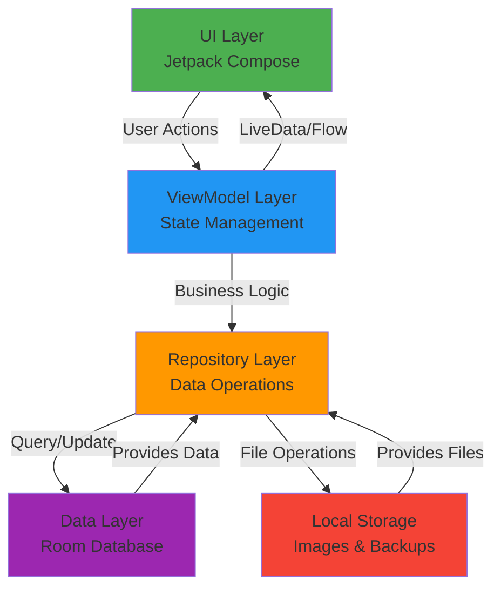

# PaisaTracker 💰

<p align="center">
  
</p>

<p align="center">
  <strong>Your Personal Expense Tracker</strong><br>
  A modern, feature-rich expense tracking app built with Kotlin & Jetpack Compose
</p>

<p align="center">
  <a href="https://www.amazon.com/dp/B0G7LNNBVM">
    
  </a>
</p>

<p align="center">
  <a href="https://github.com/harshal20m/PaisaTracker/blob/master/src/releasedFiles/PaisaTracker.apk">
    
  </a>
  <a href="https://github.com/harshal20m/PaisaTracker/blob/master/src/releasedFiles/PaisaTracker.aab">
    
  </a>
</p>

---

## 📱 Screenshots

<p align="center">
  
  
  
  
</p>

<p align="center">
  
  
  
  
</p>

<p align="center">
  
  
  
  
</p>

<p align="center">
  
  
  
  
</p>

---

## ✨ Features

### 📊 **Expense Management**
- **Project-Based Organization**: Create multiple projects (e.g., "Vacation," "Monthly Budget," "Business Expenses")
- **Smart Categorization**: Organize expenses with custom categories and emojis
- **Quick Expense Entry**: Add expenses with amount, description, date, and payment method
- **Receipt Attachments**: Attach photos and images to your expenses
- **Edit & Delete**: Full control over your expense data

### 📈 **Analytics & Insights**
- **Interactive Charts**: Beautiful pie charts showing expense distribution
- **Category Breakdown**: Detailed analysis by category
- **Project Summary**: View total spending per project
- **Time-based Insights**: Track spending patterns over time

### 💾 **Backup & Export**
- **Full Database Backup**: Create complete backups including all data and images
- **Recent Backups**: Track and manage your backup history
- **CSV Export**: Export project data to spreadsheet format
- **Easy Restore**: One-click restore from backup files
- **Cross-device Transfer**: Share backups across devices

### 🖼️ **Assets Gallery**
- **Image Library**: Centralized gallery for all your receipts and documents
- **Quick Access**: Browse all images in one place
- **Camera Integration**: Take photos directly from the app
- **Gallery Import**: Import existing photos
- **Title & Descriptions**: Add context to your images

### 🔐 **Security & Privacy**
- **App Lock**: Secure your data with PIN or biometric authentication
- **Offline First**: All data stored locally on your device
- **No Cloud Sync**: Complete privacy - your data never leaves your device
- **Export Control**: You decide when and where to share your data

### 🔔 **Smart Reminders**
- **Daily Notifications**: Customizable reminder times
- **Test Notifications**: Verify notification settings instantly
- **Battery Optimization Guide**: Device-specific instructions for reliable notifications
- **Quick Time Presets**: Set reminders for 8 AM, 12 PM, or 8 PM with one tap

### 🎨 **Modern UI/UX**
- **Material Design 3**: Latest design language
- **Dark Mode Support**: Easy on the eyes
- **Smooth Animations**: Polished interactions throughout
- **Bottom Sheet Dialogs**: Modern, intuitive interfaces
- **Responsive Layout**: Adapts to different screen sizes

---

## 🛠️ Tech Stack

### **Core Technologies**
- **Language**: 100% Kotlin
- **UI Framework**: Jetpack Compose (Declarative UI)
- **Architecture**: MVVM (Model-View-ViewModel)
- **Async**: Kotlin Coroutines & Flow
- **Database**: Room Persistence Library
- **Navigation**: Jetpack Navigation Compose

### **Libraries & Tools**
| Library | Purpose |
|---------|---------|
| [Jetpack Compose](https://developer.android.com/jetpack/compose) | Modern declarative UI |
| [Room](https://developer.android.com/training/data-storage/room) | Local database |
| [Kotlin Coroutines](https://kotlinlang.org/docs/coroutines-overview.html) | Async operations |
| [Navigation Compose](https://developer.android.com/jetpack/compose/navigation) | App navigation |
| [Coil](https://coil-kt.github.io/coil/) | Image loading |
| [MPAndroidChart](https://github.com/PhilJay/MPAndroidChart) | Data visualization |
| [WorkManager](https://developer.android.com/topic/libraries/architecture/workmanager) | Background tasks |
| [DataStore](https://developer.android.com/topic/libraries/architecture/datastore) | Preferences storage |
| [Biometric](https://developer.android.com/jetpack/androidx/releases/biometric) | Fingerprint authentication |

---

## 🏛️ Architecture

This app follows the **MVVM (Model-View-ViewModel)** architecture pattern with clean separation of concerns:



### **Layer Breakdown**

#### 📱 **UI Layer** (Compose)
- `MainActivity.kt` - Entry point with app lock
- `ui/main/` - Home screen & project list
- `ui/expense/` - Expense management screens
- `ui/details/` - Project details & insights
- `ui/export/` - Backup & export functionality
- `ui/assets/` - Image gallery
- `ui/settings/` - App settings & configuration

#### 🎯 **ViewModel Layer**
- `PaisaTrackerViewModel.kt` - Central state management
- Handles UI state and business logic
- Manages data flow with Coroutines & Flow

#### 📦 **Repository Layer**
- `PaisaTrackerRepository.kt` - Single source of truth
- Coordinates data operations
- Abstracts data sources from ViewModels

#### 💾 **Data Layer**
- `data/` - Room entities and DAOs
- `PaisaTrackerDatabase.kt` - Database configuration
- `util/BackupManager.kt` - Backup operations

---

## 🚀 Getting Started

### **Prerequisites**
- Android Studio Hedgehog (2023.1.1) or newer
- JDK 17 or higher
- Android SDK (API 24+)
- Git

### **Installation Steps**

1. **Clone the repository**
   ```bash
   git clone https://github.com/harshal20m/Expense-Tracker-Kotlin.git
   cd Expense-Tracker-Kotlin
   ```

2. **Open in Android Studio**
    - Launch Android Studio
    - Select `File > Open`
    - Navigate to the cloned directory
    - Click `OK`

3. **Sync Gradle**
    - Android Studio will automatically sync Gradle
    - Wait for dependencies to download

4. **Build & Run**
   ```bash
   # Via Android Studio: Click the "Run" button
   # Or via command line:
   ./gradlew assembleDebug
   ./gradlew installDebug
   ```

### **Download Pre-built App**

Don't want to build from source? Download the latest release:

- **APK**: [Download from releases](releases/latest/PaisaTracker.apk)
- **AAB**: [Download from releases](releases/latest/PaisaTracker.aab)
- **Amazon Appstore**: [Get it on Amazon](https://www.amazon.com/dp/YOUR_APP_ID)

---

## 📁 Project Structure

```
PaisaTracker/
├── app/
│   ├── src/
│   │   ├── main/
│   │   │   ├── java/com/example/paisatracker/
│   │   │   │   ├── data/              # Database entities & DAOs
│   │   │   │   ├── ui/                # UI components
│   │   │   │   │   ├── main/          # Home screen
│   │   │   │   │   ├── expense/       # Expense screens
│   │   │   │   │   ├── details/       # Project details
│   │   │   │   │   ├── export/        # Backup & export
│   │   │   │   │   ├── assets/        # Gallery
│   │   │   │   │   ├── settings/      # Settings
│   │   │   │   │   └── common/        # Shared components
│   │   │   │   ├── util/              # Utility classes
│   │   │   │   ├── navigation/        # Navigation setup
│   │   │   │   ├── MainActivity.kt    # Entry point
│   │   │   │   ├── PaisaTrackerViewModel.kt
│   │   │   │   └── PaisaTrackerApplication.kt
│   │   │   ├── res/                   # Resources
│   │   │   └── AndroidManifest.xml
│   └── build.gradle.kts
├── screenshots/                       # App screenshots
├── releases/                          # APK/AAB builds
├── README.md
└── LICENSE
```

---

## 🎨 Key Features Implementation

### **Full Database Backup System**
```kotlin
// Creates ZIP file with database + images
val metadata = backupManager.createFullBackup(destinationUri)

// One-click restore
val success = backupManager.restoreFromBackup(sourceUri)
```

### **Smart Notifications**
```kotlin
// Daily reminder at custom time
workManager.enqueueUniquePeriodicWork(
    "daily_expense_reminder",
    ExistingPeriodicWorkPolicy.REPLACE,
    reminderRequest
)
```

### **Biometric App Lock**
```kotlin
// Secure with fingerprint or PIN
if (canAuthenticateWithBiometrics) {
    promptBiometricAuth()
} else {
    showPinInput()
}
```

---

## 📊 Database Schema

### **Core Tables**
- **Projects**: Project organization (id, name, emoji, timestamp)
- **Categories**: Expense categories (id, name, emoji, projectId)
- **Expenses**: Individual expenses (id, amount, description, date, categoryId, paymentMethod)
- **Assets**: Image attachments (id, imagePath, title, description, expenseId)
- **BackupMetadata**: Backup tracking (id, fileName, timestamp, stats)

### **Relationships**
```
Project (1) ──→ (N) Categories
Category (1) ──→ (N) Expenses
Expense (1) ──→ (N) Assets
```

---

## 🤝 Contributing

Contributions are welcome! Here's how you can help:

### **Ways to Contribute**
- 🐛 Report bugs
- 💡 Suggest new features
- 📝 Improve documentation
- 🔧 Submit pull requests

### **Development Workflow**

1. **Fork the repository**
2. **Create a feature branch**
   ```bash
   git checkout -b feature/amazing-feature
   ```
3. **Make your changes**
4. **Commit with descriptive messages**
   ```bash
   git commit -m "Add: Amazing new feature"
   ```
5. **Push to your fork**
   ```bash
   git push origin feature/amazing-feature
   ```
6. **Open a Pull Request**

### **Code Style**
- Follow [Kotlin coding conventions](https://kotlinlang.org/docs/coding-conventions.html)
- Use meaningful variable names
- Add comments for complex logic
- Write unit tests for new features

---

## 🐛 Known Issues & Roadmap

### **Known Issues**
- None currently! 🎉

### **Planned Features**
- [ ] Cloud sync (Google Drive, Dropbox)
- [ ] Budget tracking & limits
- [ ] Recurring expenses
- [ ] Multi-currency support
- [ ] Split expenses
- [ ] Receipt OCR scanning
- [ ] Widget support
- [ ] Wear OS companion app

---

## 📄 License

This project is licensed under the MIT License - see the [LICENSE](LICENSE) file for details.

```
MIT License

Copyright (c) 2025 Harshal Mali

Permission is hereby granted, free of charge, to any person obtaining a copy
of this software and associated documentation files (the "Software"), to deal
in the Software without restriction, including without limitation the rights
to use, copy, modify, merge, publish, distribute, sublicense, and/or sell
copies of the Software, and to permit persons to whom the Software is
furnished to do so, subject to the following conditions:

The above copyright notice and this permission notice shall be included in all
copies or substantial portions of the Software.
```

---

## 👨‍💻 Author

**Harshal Mali**
- GitHub: [@harshal20m](https://github.com/harshal20m)
- Email: your.email@example.com

---

## 🙏 Acknowledgments

- **Jetpack Compose** team for the amazing UI toolkit
- **Material Design** for design guidelines
- **Android community** for continuous support
- **Open source contributors** for the libraries used

---

## 📞 Support

Having issues? Found a bug? Have a feature request?

- 📧 Email: your.email@example.com
- 🐛 [Open an issue](https://github.com/harshal20m/Expense-Tracker-Kotlin/issues)
- 💬 [Start a discussion](https://github.com/harshal20m/Expense-Tracker-Kotlin/discussions)

---

## ⭐ Star History

If you find this project useful, please consider giving it a star! ⭐

[](https://star-history.com/#harshal20m/Expense-Tracker-Kotlin&Date)

---

<p align="center">
  Made with ❤️ by Harshal Mali
</p>

<p align="center">
  <a href="#paisatracker-">Back to top ⬆️</a>
</p>
